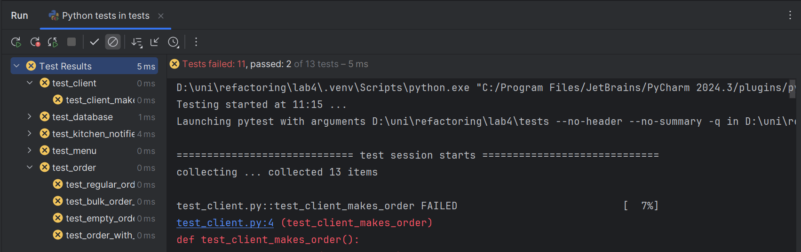
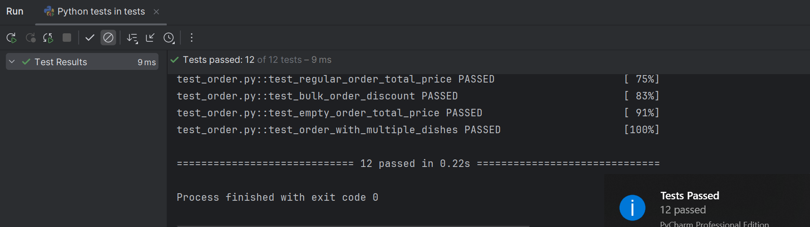

# 🧪 Звіт про результати тестування

## 🔖 Мета тестування

Перевірити працездатність основних сервісів у системі управління замовленнями ресторану:

- `MenuService`
- `OrderService`
- `KitchenService`

Мета: переконатися, що всі сервіси відповідають принципам SOLID і працюють стабільно під базовим навантаженням.

---

## 🛠 Середовище тестування

- **Python версія:** 3.11
- **Тест-раннер:** pytest 8.x
- **ОС:** Windows
- **Команда запуску:** `pytest tests/`
- **Місце розташування тестів:** `tests/test_menu.py`, `tests/test_order.py`, `tests/test_kitchen.py`

## 🔎 Журнал виконання
 - до реалізації функціоналу
 - після реаліхації

